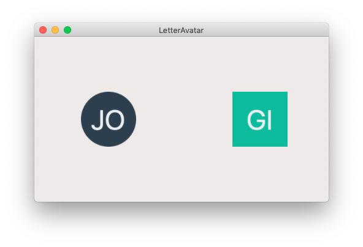

# LetterAvatarKit
An extension that generates letter-based avatars/placeholders for macOS.

The project forked from [vpeschenkov/LetterAvatarKit](https://github.com/vpeschenkov/LetterAvatarKit), I just make it works on Cocoa desktop(macOS). 
Please read the Documents & Usage from [vpeschenkov/LetterAvatarKit](https://github.com/vpeschenkov/LetterAvatarKit)

# Screenshot

